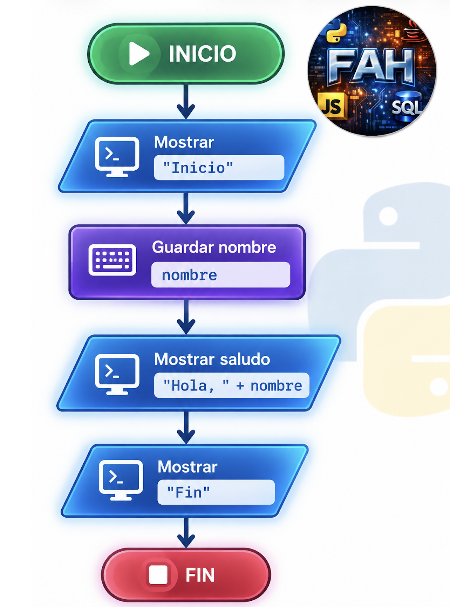
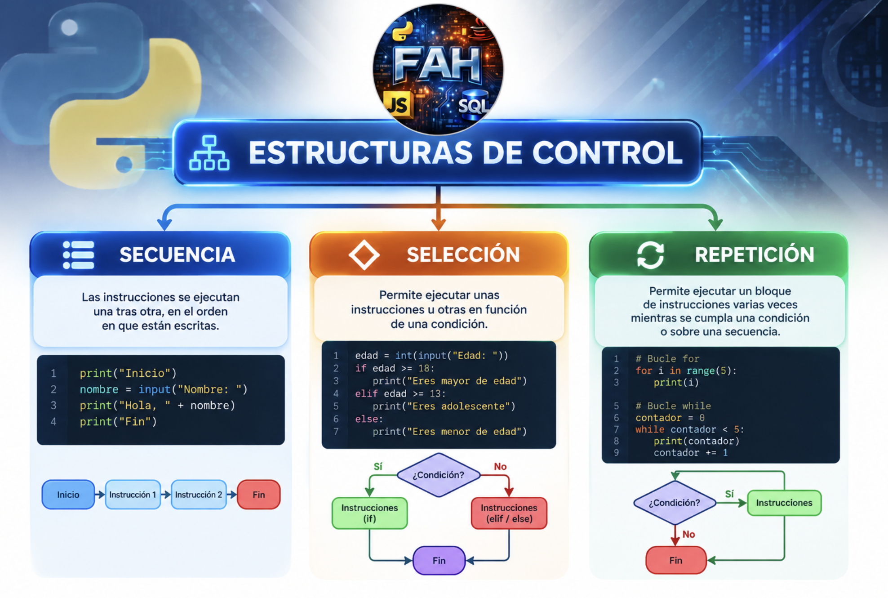

# UD1. Estructuras de control en Python

> **Módulo Profesional 5099: Estructuras de control en Python**  
> **Resultados de aprendizaje:** RA1, RA2 y RA3  
> **Duración orientativa:** primer trimestre

---

## 📑 Índice

- [1. Introducción](#1-introducción)
- [2. Resultados de aprendizaje](#2-resultados-de-aprendizaje)
  - [RA1. Estructuras de control](#ra1-estructuras-de-control)
  - [RA2. Sentencias condicionales](#ra2-sentencias-condicionales)
  - [RA3. Sentencias iterativas](#ra3-sentencias-iterativas)
- [3. ¿Qué es el flujo de ejecución?](#3-qué-es-el-flujo-de-ejecución)
- [4. Tipos de estructuras de control](#4-tipos-de-estructuras-de-control)
- [5. La importancia de la indentación en Python](#5-la-importancia-de-la-indentación-en-python)
- [6. Operadores necesarios para trabajar con condiciones](#6-operadores-necesarios-para-trabajar-con-condiciones)
- [7. Operadores lógicos](#7-operadores-lógicos)
- [8. Tablas de verdad básicas](#8-tablas-de-verdad-básicas)
- [9. Estructuras secuenciales](#9-estructuras-secuenciales)
- [10. Estructuras de selección](#10-estructuras-de-selección)
- [11. `if`](#11-if)
- [12. `if...else`](#12-ifelse)
- [13. `if...elif...else`](#13-ifelifelse)
- [14. Condiciones compuestas](#14-condiciones-compuestas)
- [15. Condicionales anidados](#15-condicionales-anidados)
- [16. Condicionales compactos](#16-condicionales-compactos)
- [17. Valores booleanos](#17-valores-booleanos)
- [18. Comparación de cadenas](#18-comparación-de-cadenas)
- [19. Comprobar si un dato está vacío](#19-comprobar-si-un-dato-está-vacío)
- [20. Bucles](#20-bucles)
- [21. Bucle `for`](#21-bucle-for)
- [22. `range()`](#22-range)
- [23. Ejemplo: tabla de multiplicar](#23-ejemplo-tabla-de-multiplicar)
- [24. Recorrer una cadena](#24-recorrer-una-cadena)
- [25. Recorrer una lista](#25-recorrer-una-lista)
- [26. Bucle `while`](#26-bucle-while)
- [27. Bucle infinito](#27-bucle-infinito)
- [28. `break`](#28-break)
- [29. `continue`](#29-continue)
- [30. Bucles anidados](#30-bucles-anidados)
- [31. Combinación de estructuras](#31-combinación-de-estructuras)
- [32. Ejemplo práctico: cajero automático](#32-ejemplo-práctico-cajero-automático)
- [33. Ejemplo práctico: sistema de notas](#33-ejemplo-práctico-sistema-de-notas)
- [34. Ejemplo práctico: contraseña](#34-ejemplo-práctico-contraseña)
- [35. Ejemplo práctico: menú de aplicación](#35-ejemplo-práctico-menú-de-aplicación)
- [36. Ejemplo práctico: programación de drones](#36-ejemplo-práctico-programación-de-drones)
- [37. Buenas prácticas](#37-buenas-prácticas)
- [38. Errores frecuentes](#38-errores-frecuentes)
- [39. Actividades propuestas](#39-actividades-propuestas)
- [40. Reto final de la unidad](#40-reto-final-de-la-unidad)
- [41. Resumen](#41-resumen)

---

## 1. Introducción

[⬆️ Volver al índice](#-índice)


Un programa informático está formado por una serie de instrucciones que el ordenador ejecuta siguiendo unas determinadas reglas. En los programas más sencillos, las instrucciones se ejecutan una detrás de otra, pero en aplicaciones reales necesitamos tomar decisiones y repetir determinadas operaciones.

Las **estructuras de control** permiten modificar el flujo normal de ejecución de un programa.

En Python podemos trabajar principalmente con:

- **Estructuras secuenciales:** las instrucciones se ejecutan en orden.
- **Estructuras de selección:** permiten tomar decisiones.
- **Estructuras de repetición:** permiten ejecutar un bloque varias veces.

En esta unidad aprenderemos a utilizar estas estructuras y a combinarlas para resolver problemas reales.

---

## 2. Resultados de aprendizaje

[⬆️ Volver al índice](#-índice)


### RA1. Estructuras de control

**Identifica las estructuras de control en Python relacionándolas con aplicaciones reales.**

### Criterios de evaluación

- **CE a)** Se han identificado las estructuras de control que permiten modificar el flujo de las instrucciones.
- **CE b)** Se han representado en un diagrama de flujo gráfico las estructuras de control.
- **CE c)** Se ha analizado la importancia de las condiciones en cada estructura de control.
- **CE d)** Se han tenido en cuenta la importancia de los sangrados en las estructuras de control.
- **CE e)** Se han escrito bloques de control secuencial.
- **CE f)** Se han escrito bloques de control de selección.
- **CE g)** Se han escrito bloques de control de repetición.

### RA2. Sentencias condicionales

**Reconoce las sentencias condicionales en Python aplicándolas a la resolución de problemas que impliquen toma de decisiones.**

### RA3. Sentencias iterativas

**Utiliza sentencias iterativas analizando las necesidades del código para resolver un problema.**

---

# 3. ¿Qué es el flujo de ejecución?

El **flujo de ejecución** indica el orden en el que se ejecutan las instrucciones de un programa.

Por defecto, Python ejecuta las instrucciones de arriba hacia abajo.

```python
print("Inicio")

nombre = "Ana"

print("Hola", nombre)

print("Fin")
```

El resultado será:

```text
Inicio
Hola Ana
Fin
```

Podemos representar este funcionamiento mediante un esquema:



Sin estructuras de control, nuestros programas serían muy limitados.

---

# 4. Tipos de estructuras de control

Podemos clasificar las estructuras de control en tres grandes grupos:



## 4.1. Secuencia

[⬆️ Volver al índice](#-índice)


Las instrucciones se ejecutan una detrás de otra.

```python
nombre = input("Nombre: ")
edad = int(input("Edad: "))

print("Hola", nombre)
print("Tienes", edad, "años")
```

## 4.2. Selección

[⬆️ Volver al índice](#-índice)


El programa decide qué instrucciones ejecutar dependiendo de una condición.

```python
edad = int(input("Edad: "))

if edad >= 18:
    print("Eres mayor de edad")
```

## 4.3. Repetición

[⬆️ Volver al índice](#-índice)


Permite ejecutar varias veces un bloque de instrucciones.

```python
for i in range(5):
    print("Hola")
```

---

# 5. La importancia de la indentación en Python

Una de las características fundamentales de Python es que utiliza la **indentación para delimitar bloques de código**.

En otros lenguajes se utilizan llaves:

```text
if (edad >= 18) {
    mostrar("Mayor de edad");
}
```

En Python utilizamos dos puntos y sangrado:

```python
if edad >= 18:
    print("Mayor de edad")
```

La indentación forma parte de la sintaxis del lenguaje.

## Ejemplo correcto

```python
edad = 20

if edad >= 18:
    print("Puedes acceder")
```

## Ejemplo incorrecto

```python
edad = 20

if edad >= 18:
print("Puedes acceder")
```

Python producirá un error porque la instrucción que pertenece al `if` no está indentada.

## Recomendación

Utilizaremos normalmente **4 espacios** para cada nivel de indentación.

```python
if condicion:
    instruccion_1()
    instruccion_2()
```

Para estructuras anidadas:

```python
if edad >= 18:
    if tiene_entrada:
        print("Puede acceder")
```

Cada bloque aumenta un nivel de indentación.

---

# 6. Operadores necesarios para trabajar con condiciones

Las estructuras de selección e iteración utilizan condiciones.

## 6.1. Operadores de comparación

[⬆️ Volver al índice](#-índice)


| Operador | Significado | Ejemplo |
|---|---|---|
| `==` | Igual | `edad == 18` |
| `!=` | Distinto | `edad != 18` |
| `>` | Mayor que | `edad > 18` |
| `<` | Menor que | `edad < 18` |
| `>=` | Mayor o igual | `edad >= 18` |
| `<=` | Menor o igual | `edad <= 18` |

### Ejemplos

```python
edad = 25

print(edad == 25)
print(edad > 18)
print(edad < 30)
print(edad != 20)
```

Resultado:

```text
True
True
True
True
```

---

# 7. Operadores lógicos

Podemos combinar varias condiciones utilizando:

- `and`
- `or`
- `not`

## 7.1. `and`

[⬆️ Volver al índice](#-índice)


Todas las condiciones deben cumplirse.

```python
edad = 25
tiene_entrada = True

if edad >= 18 and tiene_entrada:
    print("Puede acceder")
```

## 7.2. `or`

[⬆️ Volver al índice](#-índice)


Es suficiente con que se cumpla una condición.

```python
es_admin = False
es_profesor = True

if es_admin or es_profesor:
    print("Puede acceder")
```

## 7.3. `not`

[⬆️ Volver al índice](#-índice)


Invierte el resultado de una condición.

```python
activo = False

if not activo:
    print("El usuario está inactivo")
```

---

# 8. Tablas de verdad básicas

## `and`

| A | B | A and B |
|---|---|---|
| False | False | False |
| False | True | False |
| True | False | False |
| True | True | True |

## `or`

| A | B | A or B |
|---|---|---|
| False | False | False |
| False | True | True |
| True | False | True |
| True | True | True |

## `not`

| A | not A |
|---|---|
| False | True |
| True | False |

---

# 9. Estructuras secuenciales

La estructura secuencial es la más sencilla.

Las instrucciones se ejecutan en el mismo orden en el que aparecen.

## Ejemplo: cálculo de precio

```python
precio = 25
cantidad = 3

total = precio * cantidad

print("Total:", total)
```

Flujo:

```text
precio
  ↓
cantidad
  ↓
calcular total
  ↓
mostrar total
```

## Ejemplo: área de un rectángulo

```python
base = float(input("Base: "))
altura = float(input("Altura: "))

area = base * altura

print("Área:", area)
```

## Ejemplo: conversión de temperatura

```python
celsius = float(input("Temperatura en ºC: "))

fahrenheit = celsius * 9 / 5 + 32

print("Temperatura:", fahrenheit, "ºF")
```

---

# 10. Diagramas de flujo

Los diagramas de flujo permiten representar gráficamente un algoritmo.

Elementos habituales:

| Elemento | Uso |
|---|---|
| Óvalo | Inicio / fin |
| Rectángulo | Proceso |
| Rombo | Decisión |
| Paralelogramo | Entrada / salida |
| Flecha | Dirección del flujo |

Ejemplo conceptual:

```text
       ┌───────────┐
       │  INICIO   │
       └─────┬─────┘
             ↓
      ┌──────────────┐
      │ Pedir edad   │
      └──────┬───────┘
             ↓
       ◇ edad >= 18? ◇
          /       \
       Sí           No
        ↓            ↓
  "Mayor"        "Menor"
        \            /
         └─────┬──────┘
               ↓
          ┌─────────┐
          │   FIN   │
          └─────────┘
```

---

# 11. Estructuras de selección

Las estructuras de selección permiten que un programa tome decisiones.

La estructura básica es:

```python
if condicion:
    instrucciones
```

Ejemplo:

```python
edad = int(input("Introduce tu edad: "))

if edad >= 18:
    print("Eres mayor de edad")
```

Si la condición es `True`, se ejecuta el bloque.

Si es `False`, se continúa después del bloque.

---

# 12. `if...else`

Cuando necesitamos ejecutar una alternativa si la condición no se cumple:

```python
edad = int(input("Edad: "))

if edad >= 18:
    print("Mayor de edad")
else:
    print("Menor de edad")
```

Tenemos dos caminos:

```text
             edad >= 18?
              /       \
            Sí         No
             ↓          ↓
          Mayor       Menor
```

---

# 13. `if...elif...else`

Cuando existen varias posibilidades podemos utilizar `elif`.

```python
nota = float(input("Nota: "))

if nota < 5:
    print("Suspenso")
elif nota < 7:
    print("Aprobado")
elif nota < 9:
    print("Notable")
else:
    print("Sobresaliente")
```

Python evalúa las condiciones de arriba hacia abajo.

En cuanto encuentra una condición verdadera, ejecuta ese bloque y continúa después de toda la estructura.

---

# 14. Condiciones compuestas

Podemos combinar operadores.

```python
edad = 25
nacionalidad = "ES"

if edad >= 18 and nacionalidad == "ES":
    print("Puede realizar el trámite")
```

Otro ejemplo:

```python
dia = "sábado"

if dia == "sábado" or dia == "domingo":
    print("Fin de semana")
```

---

# 15. Condicionales anidados

Una estructura condicional puede contener otra estructura condicional.

```python
edad = int(input("Edad: "))

if edad >= 18:
    carnet = input("¿Tienes carnet? ")

    if carnet == "si":
        print("Puedes conducir")
    else:
        print("Necesitas carnet")
else:
    print("No puedes conducir")
```

Debemos prestar especial atención a la indentación.

---

# 16. Condicionales compactos

Python permite escribir determinadas condiciones de forma compacta.

```python
edad = 20

mensaje = "Mayor" if edad >= 18 else "Menor"

print(mensaje)
```

Es equivalente a:

```python
if edad >= 18:
    mensaje = "Mayor"
else:
    mensaje = "Menor"
```

La versión compacta es útil cuando la decisión es sencilla.

---

# 17. Valores booleanos

Las condiciones trabajan con valores booleanos:

```python
True
False
```

Ejemplo:

```python
activo = True

if activo:
    print("Usuario activo")
```

También podemos guardar directamente el resultado de una comparación:

```python
edad = 25

es_mayor = edad >= 18

print(es_mayor)
```

Resultado:

```text
True
```

---

# 18. Comparación de cadenas

Las cadenas también pueden utilizarse en condiciones.

```python
usuario = input("Usuario: ")

if usuario == "admin":
    print("Acceso de administrador")
```

Podemos utilizar métodos:

```python
respuesta = input("¿Continuar? ")

if respuesta.lower() == "si":
    print("Continuamos")
```

---

# 19. Comprobar si un dato está vacío

Las cadenas vacías se consideran falsas en un contexto booleano.

```python
nombre = input("Nombre: ")

if nombre:
    print("Nombre introducido")
else:
    print("No has introducido ningún nombre")
```

---

# 20. Bucles

Los bucles permiten repetir instrucciones.

Python dispone principalmente de:

```python
for
while
```

La elección depende del problema.

---

# 21. Bucle `for`

Utilizamos `for` cuando normalmente conocemos el conjunto de elementos que queremos recorrer o el número de repeticiones.

```python
for i in range(5):
    print(i)
```

Resultado:

```text
0
1
2
3
4
```

Importante: `range(5)` genera valores desde `0` hasta `4`.

---

# 22. `range()`

Podemos utilizar diferentes formas.

## Un parámetro

```python
for i in range(5):
    print(i)
```

Genera:

```text
0 1 2 3 4
```

## Dos parámetros

```python
for i in range(2, 6):
    print(i)
```

Genera:

```text
2 3 4 5
```

## Tres parámetros

```python
for i in range(0, 10, 2):
    print(i)
```

Genera:

```text
0 2 4 6 8
```

También podemos utilizar pasos negativos:

```python
for i in range(10, 0, -1):
    print(i)
```

---

# 23. Ejemplo: tabla de multiplicar

```python
numero = int(input("Número: "))

for i in range(1, 11):
    print(numero, "x", i, "=", numero * i)
```

Ejemplo de salida:

```text
5 x 1 = 5
5 x 2 = 10
5 x 3 = 15
...
5 x 10 = 50
```

---

# 24. Recorrer una cadena

`for` también permite recorrer caracteres.

```python
nombre = "Python"

for letra in nombre:
    print(letra)
```

Resultado:

```text
P
y
t
h
o
n
```

---

# 25. Recorrer una lista

```python
frutas = ["manzana", "pera", "plátano"]

for fruta in frutas:
    print(fruta)
```

Podemos utilizar condiciones dentro del bucle:

```python
notas = [4, 7, 9, 3, 8]

for nota in notas:
    if nota >= 5:
        print(nota, "Aprobado")
    else:
        print(nota, "Suspenso")
```

---

# 26. Bucle `while`

`while` repite un bloque mientras una condición sea verdadera.

```python
contador = 0

while contador < 5:
    print(contador)
    contador += 1
```

Resultado:

```text
0
1
2
3
4
```

Es fundamental modificar las variables que intervienen en la condición para evitar bucles infinitos.

---

# 27. Bucle infinito

Este código genera un bucle infinito:

```python
contador = 0

while contador < 5:
    print(contador)
```

La variable `contador` nunca cambia.

La condición siempre será verdadera.

La solución:

```python
contador = 0

while contador < 5:
    print(contador)
    contador += 1
```

---

# 28. `break`

`break` permite salir inmediatamente de un bucle.

```python
while True:
    palabra = input("Escribe una palabra: ")

    if palabra == "salir":
        break

    print("Has escrito:", palabra)
```

El bucle continúa hasta que el usuario escribe `salir`.

---

# 29. `continue`

`continue` hace que Python pase directamente a la siguiente iteración.

```python
for numero in range(1, 11):

    if numero % 2 == 0:
        continue

    print(numero)
```

Resultado:

```text
1
3
5
7
9
```

Estamos ignorando los números pares.

---

# 30. Bucles anidados

Podemos colocar un bucle dentro de otro.

```python
for fila in range(3):
    for columna in range(4):
        print(fila, columna)
```

Esto resulta especialmente útil para trabajar con estructuras bidimensionales.

Ejemplo:

```python
for fila in range(3):
    for columna in range(3):
        print("*", end=" ")
    print()
```

Resultado:

```text
* * *
* * *
* * *
```

---

# 31. Combinación de estructuras

Los programas reales combinan secuencias, condiciones y bucles.

Ejemplo:

```python
for numero in range(1, 11):

    if numero % 2 == 0:
        print(numero, "es par")
    else:
        print(numero, "es impar")
```

Aquí tenemos:

- Un bucle `for`.
- Una condición `if`.
- Un `else`.
- Un operador `%`.
- Una secuencia de instrucciones.

---

# 32. Ejemplo práctico: cajero automático

Podemos utilizar las estructuras de control para crear un pequeño cajero.

```python
saldo = 1000

opcion = ""

while opcion != "4":

    print("\n--- CAJERO ---")
    print("1. Consultar saldo")
    print("2. Ingresar dinero")
    print("3. Retirar dinero")
    print("4. Salir")

    opcion = input("Opción: ")

    if opcion == "1":
        print("Saldo:", saldo)

    elif opcion == "2":
        cantidad = float(input("Cantidad: "))
        saldo += cantidad
        print("Ingreso realizado")

    elif opcion == "3":
        cantidad = float(input("Cantidad: "))

        if cantidad <= saldo:
            saldo -= cantidad
            print("Retirada realizada")
        else:
            print("Saldo insuficiente")

    elif opcion == "4":
        print("Hasta pronto")

    else:
        print("Opción incorrecta")
```

Este ejemplo combina:

- Variables.
- Entrada de datos.
- Secuencia.
- Condicionales.
- Condicionales anidados.
- Bucles.
- Operadores.
- Control del flujo.

---

# 33. Ejemplo práctico: sistema de notas

```python
cantidad = int(input("Número de alumnos: "))

aprobados = 0
suspensos = 0

for i in range(cantidad):

    nota = float(input(f"Nota del alumno {i + 1}: "))

    if nota >= 5:
        aprobados += 1
    else:
        suspensos += 1

print("Aprobados:", aprobados)
print("Suspensos:", suspensos)
```

---

# 34. Ejemplo práctico: contraseña

```python
usuario_correcto = "admin"
password_correcta = "1234"

intentos = 0
acceso = False

while intentos < 3:

    usuario = input("Usuario: ")
    password = input("Contraseña: ")

    if usuario == usuario_correcto and password == password_correcta:
        acceso = True
        break

    print("Datos incorrectos")
    intentos += 1

if acceso:
    print("Acceso permitido")
else:
    print("Cuenta bloqueada")
```

Este ejemplo permite trabajar con:

- `while`.
- `if`.
- `and`.
- `break`.
- Variables booleanas.
- Contadores.

---

# 35. Ejemplo práctico: menú de aplicación

Los menús son un caso habitual de utilización de estructuras de control.

```python
opcion = ""

while opcion != "0":

    print("""
    1. Alta de usuario
    2. Mostrar usuarios
    3. Eliminar usuario
    0. Salir
    """)

    opcion = input("Selecciona una opción: ")

    if opcion == "1":
        print("Alta de usuario")

    elif opcion == "2":
        print("Mostrar usuarios")

    elif opcion == "3":
        print("Eliminar usuario")

    elif opcion == "0":
        print("Saliendo...")

    else:
        print("Opción no válida")
```

Este patrón aparecerá posteriormente en aplicaciones más complejas.

---

# 36. Ejemplo práctico: programación de drones

Las estructuras de control también pueden utilizarse para automatizar dispositivos físicos.

Por ejemplo, una secuencia conceptual de vuelo podría ser:

```python
despegar()

for i in range(4):
    avanzar()
    girar_derecha(90)

aterrizar()
```

Podemos introducir condiciones:

```python
if bateria > 20:
    despegar()
    ejecutar_ruta()
    aterrizar()
else:
    print("Batería insuficiente")
```

Y un control de seguridad:

```python
while bateria > 20:

    avanzar()

    if obstaculo_detectado:
        parar()
        girar_derecha()
```

En unidades posteriores aplicaremos estos conceptos a la **programación de drones con Python**.

---

# 37. Buenas prácticas

## Utilizar nombres descriptivos

Mejor:

```python
numero_alumnos = 20
```

que:

```python
x = 20
```

## Evitar condiciones innecesariamente complejas

Mejor:

```python
if edad >= 18:
    print("Mayor")
```

que crear expresiones difíciles de interpretar.

## Mantener una indentación consistente

```python
if usuario_activo:
    print("Usuario activo")
    mostrar_menu()
```

## Evitar bucles infinitos accidentales

Comprobar siempre que un `while` pueda terminar.

## Dividir problemas grandes

Si una solución empieza a crecer demasiado, posteriormente podremos utilizar funciones para dividirla en partes más pequeñas.

---

# 38. Errores frecuentes

### Confundir `=` con `==`

Incorrecto:

```python
if edad = 18:
```

Correcto:

```python
if edad == 18:
```

`=` asigna un valor.

`==` compara valores.

---

### Olvidar los dos puntos

Incorrecto:

```python
if edad >= 18
    print("Mayor")
```

Correcto:

```python
if edad >= 18:
    print("Mayor")
```

---

### Incorrecta indentación

Incorrecto:

```python
if edad >= 18:
print("Mayor")
```

Correcto:

```python
if edad >= 18:
    print("Mayor")
```

---

### Error en `range()`

```python
for i in range(5):
    print(i)
```

No imprime 5.

Imprime:

```text
0
1
2
3
4
```

---

# 39. Actividades propuestas

## Actividad 1. Mayor de edad

Solicita la edad de una persona e indica si es mayor o menor de edad.

---

## Actividad 2. Número positivo, negativo o cero

Solicita un número e indica:

- Positivo.
- Negativo.
- Cero.

---

## Actividad 3. Calculadora

Solicita dos números y una operación:

```text
+
-
*
/
```

Realiza la operación correspondiente.

Controla también la división entre cero.

---

## Actividad 4. Calificación

Solicita una nota entre 0 y 10 e indica:

- Suspenso.
- Aprobado.
- Notable.
- Sobresaliente.

---

## Actividad 5. Tabla de multiplicar

Solicita un número y muestra su tabla del 1 al 10.

---

## Actividad 6. Contador

Muestra los números del 1 al 100.

Posteriormente modifica el programa para mostrar solamente los números pares.

---

## Actividad 7. Suma acumulada

Solicita números al usuario hasta que introduzca `0`.

Al finalizar muestra la suma total.

Ejemplo:

```text
Número: 5
Número: 8
Número: 10
Número: 0

Suma: 23
```

---

## Actividad 8. Contraseña

Permite al usuario introducir una contraseña.

El usuario tendrá un máximo de tres intentos.

Si introduce la contraseña correcta:

```text
Acceso permitido
```

Si agota los tres intentos:

```text
Usuario bloqueado
```

---

## Actividad 9. Menú

Crea un menú con:

```text
1. Saludar
2. Mostrar fecha
3. Mostrar información
0. Salir
```

El menú debe repetirse hasta seleccionar `0`.

---

## Actividad 10. Número secreto

El programa debe almacenar un número secreto.

El usuario tendrá que adivinarlo.

Después de cada intento el programa indicará:

- "El número es mayor".
- "El número es menor".
- "¡Correcto!"

---

# 40. Reto final de la unidad

## Sistema de gestión de acceso

Desarrolla un programa que simule el control de acceso a una instalación.

El programa deberá:

1. Solicitar usuario y contraseña.
2. Permitir un máximo de tres intentos.
3. Mostrar un menú después del acceso.
4. El menú tendrá:

```text
1. Registrar entrada
2. Registrar salida
3. Consultar estado
4. Salir
```

5. El programa deberá mantenerse funcionando hasta seleccionar `4`.
6. No se permitirá registrar una salida si no existe una entrada.
7. No se permitirá registrar una segunda entrada si el usuario ya está dentro.
8. El programa deberá mostrar mensajes apropiados en cada situación.

### Ejemplo

```text
=== CONTROL DE ACCESO ===

Usuario: alumno
Contraseña: 1234

Acceso permitido.

1. Registrar entrada
2. Registrar salida
3. Consultar estado
4. Salir

Opción: 1

Entrada registrada.

Opción: 3

Estado: DENTRO

Opción: 1

Error: ya existe una entrada registrada.
```

---

# 41. Resumen

En esta unidad hemos aprendido que las estructuras de control permiten modificar el flujo de ejecución de un programa.

Las tres estructuras fundamentales son:

### Secuencia

```python
instruccion_1()
instruccion_2()
instruccion_3()
```

### Selección

```python
if condicion:
    instrucciones
else:
    instrucciones
```

### Repetición

```python
for elemento in elementos:
    instrucciones
```

o:

```python
while condicion:
    instrucciones
```

También hemos trabajado:

- Operadores de comparación.
- Operadores lógicos.
- Valores booleanos.
- Indentación.
- Diagramas de flujo.
- Condicionales anidados.
- `range()`.
- `break`.
- `continue`.
- Bucles anidados.
- Resolución de problemas.
- Aplicaciones prácticas.

Estos conocimientos serán la base para las siguientes unidades y, posteriormente, para desarrollar aplicaciones con **Django** y realizar proyectos de **programación de drones con Python**.
