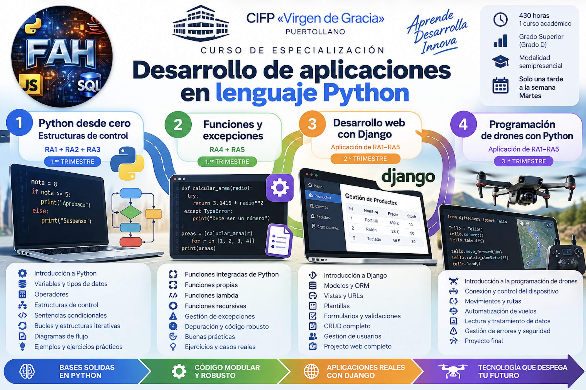

# 🐍 Desarrollo de Aplicaciones en Python

Apuntes del **Curso de Especialización en Desarrollo de Aplicaciones en Python**.

---

### Unidades didácticas

- [**UD1. Entornos de desarrollo en Python**](ud1/index.md)

## 📘 Módulo Profesional 5098: Entornos y sintaxis en Python

| Código | Módulo Profesional | Horas | ECTS |
|:------:|--------------------|:-----:|:----:|
| **5098** | **Entornos y sintaxis en Python** | **25** | **3** |

### Resultados de aprendizaje

### RA1. Análisis y resolución de problemas

**Analiza los problemas planteados, identificando los entornos de aplicación y proponiendo estrategias para su resolución.**

**Criterios de evaluación:**

- **CE a)** Se han identificado las características principales de los entornos de aplicación.
- **CE b)** Se han definido estrategias conducentes a la resolución del problema.
- **CE c)** Se han analizado las dificultades que puedan presentarse.
- **CE d)** Se han realizado diagramas de flujo de las soluciones propuestas.
- **CE e)** Se ha seleccionado el diagrama de flujo considerado óptimo.
- **CE f)** Se ha verificado que la solución propuesta es susceptible de ser implementada en Python.

---

### RA2. Elementos de la programación en Python

**Caracteriza elementos de la programación en Python, identificando los bloques fundamentales de construcción de un programa.**

**Criterios de evaluación:**

- **CE a)** Se han definido los aspectos fundamentales de la programación de alto nivel.
- **CE b)** Se han establecido las diferencias entre lenguajes compilados e interpretados.
- **CE c)** Se han analizado los bloques principales en la construcción de un programa en Python.
- **CE d)** Se han establecido las diferencias entre diferentes versiones de Python.
- **CE e)** Se han identificado los errores más frecuentes en la programación en Python.
- **CE f)** Se ha valorado la importancia de la depuración de código.
- **CE g)** Se han analizado segmentos de código, antes y después de la depuración.

---

### RA3. Entornos de trabajo

**Evalúa entornos de trabajo para el desarrollo de aplicaciones en Python, indicando sus diferencias y áreas específicas de trabajo.**

**Criterios de evaluación:**

- **CE a)** Se han analizado los IDE (Integrated Development Environment) más habituales usados en la programación en Python.
- **CE b)** Se han seleccionado IDE, en función del desarrollo a realizar.
- **CE c)** Se han analizado las ventajas del uso de frameworks (marcos, esquemas) en el desarrollo de software con Python.
- **CE d)** Se han comparado diversos editores de código en Python relacionándolos con desarrollos de aplicaciones concretas.
- **CE e)** Se ha puesto de manifiesto la utilidad del uso de IDLE y frameworks mediante el análisis de software real.

---

### RA4. IDLE y Python Shell

**Utiliza el IDLE básico de Python y la ventana Shell, introduciendo los principios de la escritura de software en Python.**

**Criterios de evaluación:**

- **CE a)** Se han escrito instrucciones elementales para visualizar el funcionamiento básico del lenguaje.
- **CE b)** Se ha escrito una instrucción en una sola línea.
- **CE c)** Se ha razonado la mala praxis de escribir varias instrucciones en una línea.
- **CE d)** Se ha escrito una instrucción en varias líneas.
- **CE e)** Se han escrito en consola las instrucciones.
- **CE f)** Se han utilizado sangrados explicando su utilidad.
- **CE g)** Se han escrito comentarios en Python.
- **CE h)** Se han instalado y probado editores de texto no integrados en el entorno.

---

### RA5. Sintaxis, operadores y tipos de datos

**Aplica la sintaxis y operadores y tipos simples y complejos en Python, escribiendo instrucciones básicas y verificando sus resultados.**

**Criterios de evaluación:**

- **CE a)** Se ha escrito código con sintaxis básica.
- **CE b)** Se conocen y distinguen los distintos tipos de operadores.
- **CE c)** Se han escrito instrucciones básicas con cada tipo de operador.
- **CE d)** Se distinguen y utilizan los distintos tipos de datos.
- **CE e)** Se han utilizado los distintos tipos de operadores en un código básico.
- **CE f)** Se han hecho operaciones entre iguales y distintos tipos de datos.

---

## 📗 Módulo Profesional 5099: Estructuras de control en Python

| Código | Módulo Profesional | Horas | ECTS |
|:------:|--------------------|:-----:|:----:|
| **5099** | **Estructuras de control en Python** | **40** | **5** |

## 📘 Unidades Didácticas

- [UD1. Estructuras de control en Python](estructuras/ud1/estru_control.md)
- [UD2. Funciones y gestión de errores en Python](ud2.md)
- [UD3. Desarrollo de aplicaciones web con Django](ud3.md)
- [UD4. Programación y control de drones con Python](ud4.md)

## Ejercicios

- [UD1. Estructuras de control en Python](estructuras/ud1/ud1_ejercicios.md)

### Resultados de aprendizaje

### RA1. Estructuras de control

**Identifica las estructuras de control en Python relacionándolas con aplicaciones reales.**

**Criterios de evaluación:**

- **CE a)** Se han identificado las estructuras de control que permiten modificar el flujo de las instrucciones.
- **CE b)** Se han representado en un diagrama de flujo gráfico las estructuras de control.
- **CE c)** Se han analizado la importancia de las condiciones en cada estructura de control.
- **CE d)** Se han tenido en cuenta la importancia de los sangrados en las estructuras de control.
- **CE e)** Se han escrito bloques de control secuencial.
- **CE f)** Se han escrito bloques de control de selección.
- **CE g)** Se han escrito bloques de control de repetición.

---

### RA2. Sentencias condicionales

**Reconoce las sentencias condicionales en Python aplicándolas a la resolución de problemas que impliquen toma de decisiones.**

**Criterios de evaluación:**

- **CE a)** Se ha interpretado el concepto de sentencia condicional.
- **CE b)** Se han identificado las partes de las que consta una sentencia condicional.
- **CE c)** Se ha aplicado correctamente el sangrado.
- **CE d)** Se ha aplicado la ejecución condicional y control de variables.
- **CE e)** Se han interpretado el funcionamiento de las sentencias condicionales.
- **CE f)** Se han aplicado correctamente las sentencias condicionales.
- **CE g)** Se han interpretado y aplicado correctamente las anidaciones.
- **CE h)** Se aplica correctamente la sintaxis a aplicar en estructuras compactas.
- **CE i)** Se han escrito bloques de programas utilizando sentencias condicionales.
- **CE j)** Se han escrito bloques de programas utilizando sentencias condicionales anidadas.

---

### RA3. Sentencias iterativas

**Utiliza sentencias iterativas analizando las necesidades del código para resolver un problema.**

**Criterios de evaluación:**

- **CE a)** Se ha interpretado el concepto de sentencia iterativa.
- **CE b)** Se ha diferenciado entre estructuras condicionales e iterativas.
- **CE c)** Se ha verificado el funcionamiento de las sentencias iterativas.
- **CE d)** Se han aplicado las sentencias iterativas de acuerdo a las necesidades.
- **CE e)** Se han escrito bloques de programas utilizando los bucles `for` y `while`.
- **CE f)** Se han interpretado y aplicado los anidamientos de estructuras.

---

### RA4. Funciones

**Aplica funciones de Python de distintos tipos mejorando la eficiencia del programa.**

**Criterios de evaluación:**

- **CE a)** Se comprende la necesidad de usar funciones de Python y sus ventajas.
- **CE b)** Se ha escrito código que incluya funciones Build-in de Python.
- **CE c)** Se ha escrito un programa con funciones definidas por la propia persona usuaria.
- **CE d)** Se aplican correctamente las funciones lambda en un programa de Python.
- **CE e)** Se han creado funciones recursivas partiendo de funciones definidas anteriormente por la persona usuaria.

---

### RA5. Arquitectura de código y excepciones

**Crea arquitectura de código de forma eficiente y escribe código robusto.**

**Criterios de evaluación:**

- **CE a)** Se ha diferenciado entre el concepto de excepción y los errores de sintaxis.
- **CE b)** Se ha escrito instrucciones de captura de excepciones.
- **CE c)** Se han capturado y tratado excepciones.
- **CE d)** Se han tratado excepciones.
- **CE e)** Se han realizado depuraciones de excepciones correctamente.
- **CE f)** Se han escrito bloques de código robusto utilizando las sentencias adecuadas.